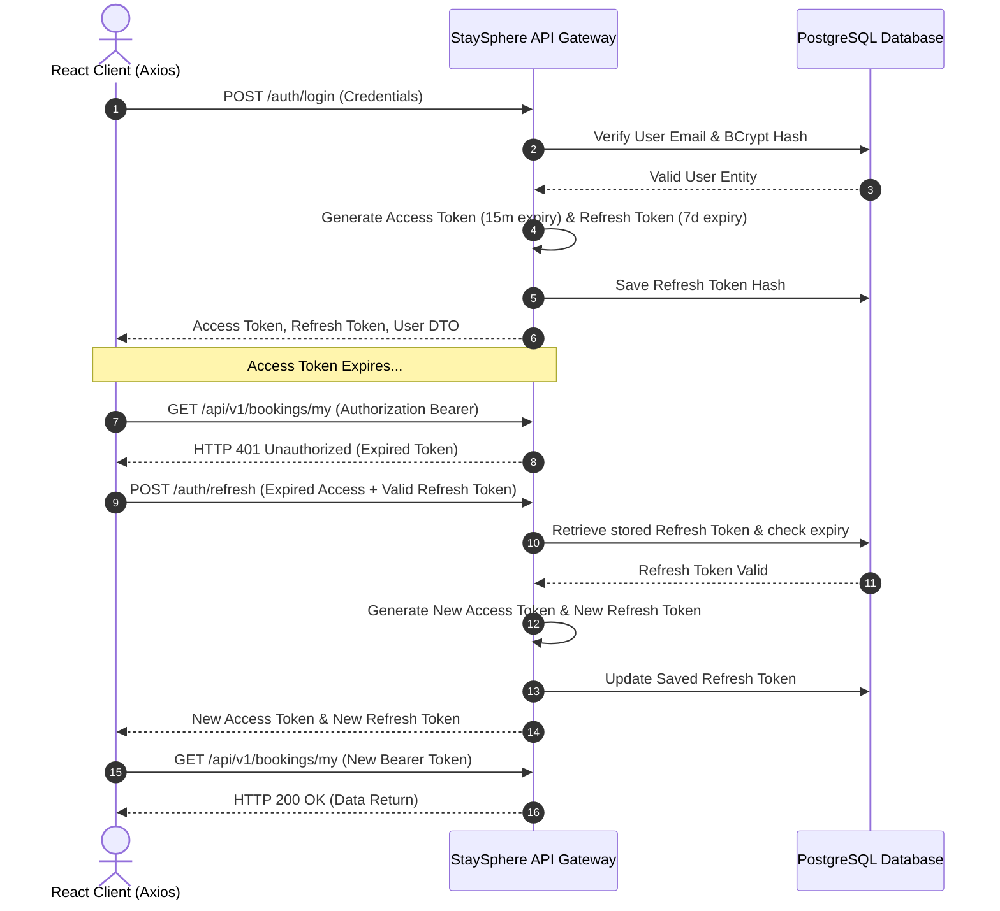
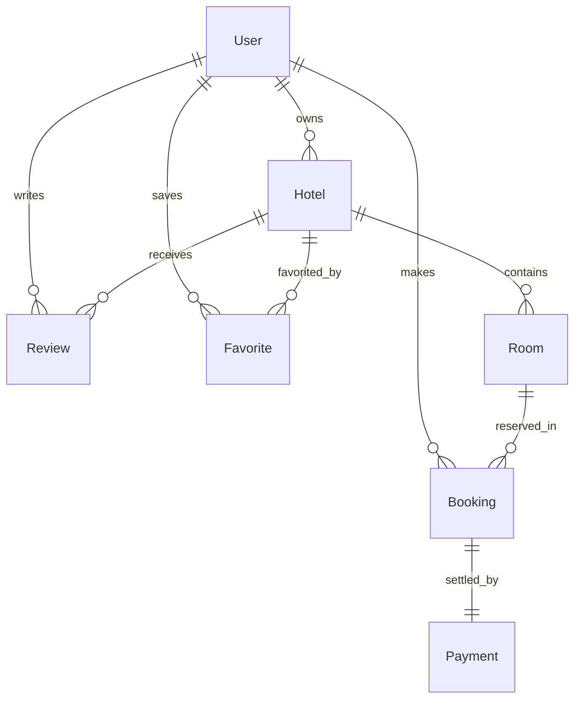

# 🏨 StaySphere Enterprise Hotel Management Platform

StaySphere is a production-ready, highly scalable, and secure hotel management and reservation ecosystem designed utilizing Enterprise Design Patterns, **Domain-Driven Design (DDD)** principles, and **Clean Architecture**. The platform features real-time notifications, intelligent caching, background task workers, role-based access control, and an integrated AI assistant.

This documentation provides an exhaustive, end-to-end blueprint of the entire codebase, architecture, database schemas, REST APIs, deployment configurations, and development workflows.

---

## 🗺️ Architectural Topology & System Flows

StaySphere is built on a decoupled Client-Server architecture. The communication flows and database syncs follow strict transactional borders.

### High-Level System Architecture
```mermaid
graph TD
    %% Client Layer
    subgraph Client Layer (Vite + React SPA)
        A[React App] -->|Axios with Token Rotation| B[REST API Client]
        A -->|SignalR client| C[Real-Time Notifications]
    end

    %% API Gateway & Application Layer
    subgraph API Presentation & Routing
        D[StaySphere API Gateway] -->|JWT Auth Middleware| E[Auth & Route Guard]
        D -->|Swagger OpenAPI| F[Endpoint Documentation]
        D -->|SignalR Hubs| G[NotificationHub /hubs/notifications]
    end

    %% Clean Architecture Application Core
    subgraph Application Core (CQRS & Services)
        H[StaySphere.Application] -->|MediatR Command/Query| I[Handlers & Validators]
        H -->|Interfaces| J[Service Contracts]
        K[StaySphere.Domain] -->|Core Entities| H
    end

    %% Infrastructure & Persistance Layer
    subgraph Infrastructure & Adapters
        L[StaySphere.Infrastructure] -->|EF Core Provider| M[(PostgreSQL 16 DB)]
        L -->|StackExchange.Redis| N[(Redis 7 Cache)]
        L -->|Hangfire Server| O[Background Job Queues]
        L -->|BCrypt & JWT| P[Security Manager]
        L -->|SignalR Implementation| G
    end

    %% Connections
    B --> D
    C --> G
    E --> H
    I --> L
    J --> L
```

### Authentication Token Rotation Flow (JWT)


---

## 🛠️ Detailed Technology Stack

### Backend (.NET 9.0 Ecosystem)
* **Web API Framework**: ASP.NET Core 9.0 Core Web API.
* **Architecture Pattern**: Clean Architecture with CQRS (Command Query Responsibility Segregation) to separate read and write pipelines.
* **Object-Relational Mapper**: Entity Framework Core 9.0 using the Npgsql PostgreSQL provider.
* **Database Engine**: PostgreSQL 16.
* **Caching Layer**: Redis 7.0 (Distributed cache provider via StackExchange.Redis).
* **Queue & Job Processor**: Hangfire Core (scheduled events, background tasks, using PostgreSQL database tables for storage persistence).
* **Real-time Notifications**: ASP.NET Core SignalR Websocket engine.
* **Structured Logging**: Serilog configured with Console, File, and JSON Enrichers.
* **Security & Encryption**: BCrypt.Net-Next (salted password hashing), System.IdentityModel.Tokens.Jwt (JWT bearer token signing and validation).

### Frontend (React SPA)
* **Build Engine**: Vite (super-fast ESM bundler).
* **Library**: React 18 (Hooks, dynamic states).
* **Styling Framework**: Tailwind CSS v3 (Custom color palette mapping, responsive design).
* **HTTP Client**: Axios with global request/response interceptors to automatically rotate authentication tokens.
* **Component Icons**: Lucide React.

### DevOps & Infrastructure
* **Containerization**: Docker (multi-stage base SDK image caching).
* **Orchestration**: Docker Compose (local environment matching).
* **CI/CD Platform**: GitHub Actions runner templates (`ubuntu-latest`).

---

## 📂 Deep Dive: Folder Structure & Directory Manifest

Below is the directory tree mapping showing every critical configuration, folder, project, and file in the workspace.

```text
Hotel Mangment/
├── .github/
│   └── workflows/
│       └── ci.yml               # GitHub Actions CI workflow script
├── .vscode/
│   └── settings.json            # VS Code workspace settings (ignores unknown CSS at-rules for Tailwind)
├── docker-compose.yml           # Multi-container orchestration (DB, Cache, Web API)
├── README.md                    # System documentation and manuals
├── backend/
│   ├── StaySphere.sln           # Visual Studio / dotnet CLI solution file
│   └── src/
│       ├── StaySphere.Domain/                       # Core Enterprise domain layers
│       │   ├── StaySphere.Domain.csproj            # Domain project metadata
│       │   ├── Class1.cs                           # Placeholder file
│       │   ├── Common/
│       │   │   └── BaseAuditableEntity.cs          # Base abstract entity with auditing fields
│       │   ├── Entities/
│       │   │   ├── User.cs                         # User entity, logins, refresh tokens, role checks
│       │   │   ├── Hotel.cs                        # Hotel entity, approvals, location info, image collections
│       │   │   ├── BookingAndReviewEntities.cs     # Room, Booking, Payment, and Review entities
│       │   │   └── FavoriteAndCouponEntities.cs    # Favorite (Wishlist) and Coupon entities
│       │   └── Enums/
│       │       └── DomainEnums.cs                  # UserRole, HotelApprovalStatus, RoomStatus, BookingStatus, PaymentStatus enums
│       │
│       ├── StaySphere.Application/                  # Core Business rules and CQRS commands/queries
│       │   ├── StaySphere.Application.csproj       # Application project metadata
│       │   ├── Common/
│       │   │   └── Interfaces/                      # DB contexts, tokens, files, and mailing interfaces
│       │   └── Features/                            # CQRS commands, queries, DTOs, and handlers grouped by feature
│       │
│       ├── StaySphere.Infrastructure/               # Technical adaptors & database providers
│       │   ├── StaySphere.Infrastructure.csproj    # Infrastructure project metadata
│       │   ├── DependencyInjection.cs               # Registration of EF Core, Redis, Identity, JWT, and services
│       │   ├── Caching/
│       │   │   └── RedisCacheService.cs             # Implementation of distributed ICacheService via Redis
│       │   ├── Identity/
│       │   │   ├── BCryptPasswordHasher.cs         # Password hashing and verifying engine
│       │   │   └── JwtTokenGenerator.cs            # JWT token creation, signing key credentials, lifetime config
│       │   ├── Persistence/
│       │   │   ├── StaySphereDbContext.cs          # EF Core context class, Fluent API mapping, audit interceptors
│       │   │   └── Migrations/                      # EF Core migration history and schema files
│       │   └── Services/
│       │       ├── AuthService.cs                  # Handles registers, logins, profile checks, and token rotations
│       │       ├── HotelService.cs                 # Handles hotel additions, approvals, and listing edits
│       │       ├── RoomService.cs                  # Manages rooms within hotels
│       │       ├── SearchService.cs                # Integrates search operations with DB and Redis cache
│       │       ├── BookingService.cs               # Orchestrates reservations and cancellations
│       │       ├── PaymentService.cs               # Integrates payment checkout sessions and refunds
│       │       ├── ReviewService.cs                # Creates and aggregates ratings
│       │       ├── FavoriteService.cs              # Manages user-specific hotel wishlists
│       │       ├── CouponService.cs                # Creates, deactivates, and validates promotional discount codes
│       │       ├── NotificationService.cs          # Implements real-time messaging
│       │       └── AiService.cs                    # Integrates AI engine simulations
│       │
│       ├── StaySphere.API/                          # Presentation gateway & REST controller endpoints
│       │   ├── StaySphere.API.csproj               # API project metadata
│       │   ├── Program.cs                           # App bootstrapper, pipeline registrations, DB seeds
│       │   ├── Dockerfile                           # Multi-stage production build manifest
│       │   ├── appsettings.json                     # Main configuration settings
│       │   ├── appsettings.Development.json         # Development settings
│       │   ├── Hubs/
│       │   │   └── NotificationHub.cs               # SignalR hub class for real-time ws pipelines
│       │   ├── Services/
│       │   │   └── SignalRNotificationService.cs    # Implementation of notification service via SignalR hubs
│       │   └── Controllers/
│       │       ├── AuthController.cs                # Routes login, register, token refreshes, profile checks
│       │       ├── HotelsController.cs              # Routes hotel details, submits, and admin approvals
│       │       ├── RoomsController.cs               # Routes room detail updates, uploads, and status shifts
│       │       ├── SearchController.cs              # Entry point for search algorithms (supports caching)
│       │       ├── BookingsController.cs            # Entry point for room reservation requests
│       │       ├── PaymentsController.cs            # Handles payments, webhooks, and refunds
│       │       ├── ReviewsFavoritesCouponsController.cs # Aggregates reviews, user wishlists, and promo codes
│       │       ├── DashboardsController.cs          # Computes stats for Admin, Partners, and Staff
│       │       └── AiController.cs                  # Routes queries to the AI Assistant
│       │
│       └── StaySphere.UnitTests/                    # Unit testing projects for Application and Domain layers
│
└── frontend/                                        # Frontend SPA React Application
    ├── package.json                                 # Package manifests, dependencies, scripts
    ├── index.html                                   # SPA root template html
    ├── vite.config.js                               # React compiler settings
    ├── postcss.config.js                            # PostCSS modules configuration
    ├── tailwind.config.js                           # Tailwind CSS layout, colors, font maps
    └── src/
        ├── main.jsx                                 # Entrypoint React DOM wrapper
        ├── index.css                                # Tailwind directives and globally scoped styles
        ├── App.jsx                                  # View router, user contexts, role access guards (RBAC)
        ├── data/
        │   ├── api.js                               # Centralized Axios client, interceptors, and routes
        │   └── mockData.js                          # Static fallback content, trending locations
        └── components/                              # Reusable components
            ├── Navbar.jsx                           # Search bar, auth triggers, currency selection, navigations
            ├── Hero.jsx                             # Guest settings, datepickers, location inputs
            ├── FeaturedCollections.jsx              # Category selectors
            ├── TrendingDestinations.jsx             # Grid layouts for top destinations
            ├── PropertyGrid.jsx                     # Category listings
            ├── PropertyDetailView.jsx               # Review list, room tables, checkout selectors
            ├── BookingCheckout.jsx                  # Booking parameters, coupon inputs, stripe mock checkout
            ├── TravelerDashboard.jsx                # Traveler reservations, cancellation tools, wishlist drawer
            ├── OwnerDashboard.jsx                   # Partner operations dashboard
            ├── AdminPanel.jsx                       # Platform approval widgets, user logs
            ├── PropertyModal.jsx                    # Property listing modal
            ├── BookingModal.jsx                     # Interactive booking modal
            ├── WishlistDrawer.jsx                   # Wishlist side-drawer widget
            ├── MyBookingsModal.jsx                  # Listing active traveler bookings
            ├── TravelerAuthModal.jsx                # Customer login/register modal
            ├── PartnerAuthModal.jsx                 # Hotel owner login/register modal
            ├── WhyUs.jsx                            # Value proposition section
            ├── Testimonials.jsx                     # User reviews panel
            ├── Newsletter.jsx                       # Subscription form widget
            ├── Footer.jsx                           # Footer links
            └── Toast.jsx                            # Alert notification toasts
```

---

## 🗄️ Database Schema & Entities Specification

The persistence layer runs on **PostgreSQL 16**. Auditing fields are updated automatically via EF Core interceptors on every save.

### ERD Relationships Diagram


### Table Structure Specifications

#### 1. `BaseAuditableEntity` (Common Columns)
These properties are inherited by all entity tables in the database.
* `Id`: **UUID (Primary Key)**, Default: `gen_random_uuid()`
* `CreatedAtUtc`: **TIMESTAMP WITH TIME ZONE**, Default: `CURRENT_TIMESTAMP`
* `CreatedBy`: **VARCHAR(100)**, Default: `'System'`
* `LastModifiedAtUtc`: **TIMESTAMP WITH TIME ZONE**, Nullable
* `LastModifiedBy`: **VARCHAR(100)**, Nullable
* `IsDeleted`: **BOOLEAN**, Default: `FALSE` (Used for soft-deletes)

---

#### 2. `Users` Table
Stores login credentials, profile data, and session refresh tokens.
* `Email`: **VARCHAR(256)**, Unique Index, Required.
* `PasswordHash`: **TEXT**, Salted BCrypt Hash, Required.
* `FirstName`: **VARCHAR(100)**, Required.
* `LastName`: **VARCHAR(100)**, Required.
* `PhoneNumber`: **VARCHAR(30)**, Nullable.
* `Role`: **INTEGER (Enum)**, Required. Maps to:
  * `1` = `Customer`
  * `2` = `Partner` (Hotel Owner/Staff)
  * `3` = `Admin` (System Admin)
* `IsEmailVerified`: **BOOLEAN**, Default: `FALSE`.
* `ProfileImageUrl`: **TEXT**, Nullable.
* `RefreshToken`: **TEXT**, Nullable.
* `RefreshTokenExpiryTimeUtc`: **TIMESTAMP WITH TIME ZONE**, Nullable.

---

#### 3. `Hotels` Table
Stores registered hotels, locations, ratings, and approval states.
* `Name`: **VARCHAR(256)**, Required.
* `Description`: **TEXT**, Required.
* `Address`: **VARCHAR(500)**, Required.
* `City`: **VARCHAR(100)**, Index, Required.
* `Country`: **VARCHAR(100)**, Index, Required.
* `Latitude`: **DOUBLE PRECISION**, Required.
* `Longitude`: **DOUBLE PRECISION**, Required.
* `ContactNumber`: **VARCHAR(50)**, Required.
* `ContactEmail`: **VARCHAR(256)**, Required.
* `StarRating`: **DOUBLE PRECISION**, Default: `4.5`.
* `ApprovalStatus`: **INTEGER (Enum)**, Required. Maps to:
  * `0` = `Draft`
  * `1` = `PendingReview`
  * `2` = `Approved`
  * `3` = `Rejected`
  * `4` = `Suspended`
* `OwnerId`: **UUID (Foreign Key)**, References `Users.Id`, Cascade Delete.
* `ImageUrls`: **TEXT[] (Array)**, Stores references to uploaded imagery.
* `Amenities`: **TEXT[] (Array)**, Stores lists of hotel facilities.

---

#### 4. `Rooms` Table
Manages specific room listings inside a parent hotel.
* `RoomNumber`: **VARCHAR(50)**, Required.
* `RoomType`: **VARCHAR(100)**, Required. Default: `'Deluxe Suite'`.
* `Capacity`: **INTEGER**, Default: `2`.
* `PricePerNight`: **NUMERIC(18,2)**, Required.
* `Status`: **INTEGER (Enum)**, Required. Maps to:
  * `1` = `Available`
  * `2` = `Reserved`
  * `3` = `Occupied`
  * `4` = `Maintenance`
  * `5` = `OutOfService`
* `Floor`: **INTEGER**, Default: `1`.
* `HotelId`: **UUID (Foreign Key)**, References `Hotels.Id`, Cascade Delete.
* `Amenities`: **TEXT[] (Array)**, Facilities in room.
* `ImageUrls`: **TEXT[] (Array)**, Images of the room.

---

#### 5. `Bookings` Table
Tracks reservations made by customers.
* `BookingReference`: **VARCHAR(100)**, Unique Index, Required (Format: `STAY-XXXXXX`).
* `CheckInDate`: **TIMESTAMP WITH TIME ZONE**, Required.
* `CheckOutDate`: **TIMESTAMP WITH TIME ZONE**, Required.
* `GuestCount`: **INTEGER**, Default: `2`.
* `TotalAmount`: **NUMERIC(18,2)**, Required.
* `Status`: **INTEGER (Enum)**, Required. Maps to:
  * `1` = `Pending`
  * `2` = `Confirmed`
  * `3` = `Cancelled`
  * `4` = `Completed`
  * `5` = `Refunded`
  * `6` = `Expired`
* `UserId`: **UUID (Foreign Key)**, References `Users.Id`, Nullable on delete (Set Null).
* `RoomId`: **UUID (Foreign Key)**, References `Rooms.Id`, Restrict Delete.

---

#### 6. `Payments` Table
Maintains transaction records settled through payment providers.
* `TransactionId`: **VARCHAR(256)**, Required.
* `Amount`: **NUMERIC(18,2)**, Required.
* `Currency`: **VARCHAR(10)**, Default: `'USD'`.
* `Status`: **INTEGER (Enum)**, Required. Maps to:
  * `1` = `Pending`
  * `2` = `Success`
  * `3` = `Failed`
  * `4` = `Refunded`
  * `5` = `PartiallyRefunded`
* `PaymentGateway`: **VARCHAR(100)**, Default: `'Stripe'`.
* `BookingId`: **UUID (Foreign Key)**, References `Bookings.Id`, Cascade Delete.

---

#### 7. `Reviews` Table
Feedback logs written by customers for stayed properties.
* `Rating`: **INTEGER**, Range: `1` to `5`, Required.
* `Comment`: **TEXT**, Required.
* `AiSentiment`: **VARCHAR(50)**, Default: `'Positive'`. Analyzed automatically during creation.
* `UserId`: **UUID (Foreign Key)**, References `Users.Id`, Cascade Delete.
* `HotelId`: **UUID (Foreign Key)**, References `Hotels.Id`, Cascade Delete.

---

#### 8. `Favorites` Table (Wishlist)
User bookmarks to quickly save hotels.
* `UserId`: **UUID (Foreign Key)**, References `Users.Id`, Cascade.
* `HotelId`: **UUID (Foreign Key)**, References `Hotels.Id`, Cascade.
* Unique Constraint: `(UserId, HotelId)`.

---

#### 9. `Coupons` Table
Promotional discount parameters managed by system administrators.
* `Code`: **VARCHAR(50)**, Unique Index, Required.
* `DiscountPercent`: **NUMERIC(5,2)**, Percentage discount, Required.
* `MaxUses`: **INTEGER**, Max allocation count.
* `UsedCount`: **INTEGER**, Default: `0`.
* `IsActive`: **BOOLEAN**, Default: `TRUE`.
* `ExpiresAtUtc`: **TIMESTAMP WITH TIME ZONE**, Required.

---

## 📡 Complete REST API Specification

### Authentication Module (`/api/v1/auth`)

#### 1. POST `/auth/register`
Creates a new customer, partner or administrator.
* **Payload Structure**:
  ```json
  {
    "email": "traveler@staysphere.com",
    "password": "Password123!",
    "firstName": "Kasun",
    "lastName": "Silva",
    "phoneNumber": "0771234567",
    "role": 1
  }
  ```
* **Success Response (200 OK)**:
  ```json
  {
    "accessToken": "eyJhbGciOiJIUzI1NiIsInR5cCI6IkpXVCJ9...",
    "refreshToken": "7038fbcc-1111-477d-bb62-870bfb37e8c3",
    "user": {
      "id": "2708f020-f561-4cc1-a5d6-848e652a9e99",
      "email": "traveler@staysphere.com",
      "firstName": "Kasun",
      "lastName": "Silva",
      "role": "Customer"
    }
  }
  ```

#### 2. POST `/auth/login`
Validates user credentials and issues tokens.
* **Payload Structure**:
  ```json
  {
    "email": "traveler@staysphere.com",
    "password": "Password123!"
  }
  ```
* **Success Response (200 OK)**:
  ```json
  {
    "accessToken": "eyJhbGciOi...",
    "refreshToken": "7038fbcc...",
    "user": {
      "id": "2708f020...",
      "email": "traveler@staysphere.com",
      "firstName": "Kasun",
      "lastName": "Silva",
      "role": "Customer"
    }
  }
  ```
* **Failure Response (401 Unauthorized)**:
  ```json
  {
    "message": "Invalid email or password."
  }
  ```

#### 3. POST `/auth/refresh`
Performs token rotation. Returns a brand new access and refresh token pair.
* **Payload Structure**:
  ```json
  {
    "accessToken": "eyJhbGciOi...",
    "refreshToken": "7038fbcc..."
  }
  ```
* **Success Response (200 OK)**:
  ```json
  {
    "accessToken": "eyJhbGciOiNewToken...",
    "refreshToken": "NewRefreshTokenUUID..."
  }
  ```

#### 4. GET `/auth/me`
Retrieves details of the currently authenticated user session.
* **Headers**: `Authorization: Bearer <accessToken>`
* **Success Response (200 OK)**:
  ```json
  {
    "id": "2708f020-f561-4cc1-a5d6-848e652a9e99",
    "email": "traveler@staysphere.com",
    "firstName": "Kasun",
    "lastName": "Silva",
    "phoneNumber": "0771234567",
    "role": "Customer",
    "isEmailVerified": true
  }
  ```

---

### Search Module (`/api/v1/search`)

#### 1. GET `/search`
Retrieves a filtered collection of hotels. Result queries are cached inside Redis.
* **Parameters**:
  * `city` (string, optional)
  * `country` (string, optional)
  * `checkIn` (datetime, optional)
  * `checkOut` (datetime, optional)
  * `guests` (int, default: 2)
  * `minPrice` (decimal, optional)
  * `maxPrice` (decimal, optional)
  * `minRating` (double, optional)
  * `sortBy` (string, default: "Recommended")
* **Success Response (200 OK)**:
  ```json
  {
    "items": [
      {
        "id": "4bc45ee1-2489-408a-b8fb-41c64eb3c042",
        "name": "Grand Horizon Beach Resort",
        "description": "5-star luxury stay directly overlooking the Indian Ocean.",
        "address": "12 Galle Road",
        "city": "Galle",
        "country": "Sri Lanka",
        "starRating": 4.9,
        "priceFrom": 195.00,
        "imageUrls": [
          "https://images.unsplash.com/photo-1566073771259-6a8506099945"
        ],
        "amenities": ["Rooftop Pool", "Free WiFi", "Spa", "Private Beach"]
      }
    ],
    "totalCount": 1,
    "source": "Cache"
  }
  ```
  *(Note the `"source": "Cache"` field which indicates that the query response was retrieved from the Redis cache layer).*

---

### Hotel Management Module (`/api/v1/hotels` & `/api/v1/admin/hotels`)

#### 1. GET `/hotels`
Lists all approved hotels in the platform.
* **Success Response (200 OK)**:
  ```json
  [
    {
      "id": "4bc45ee1-2489-408a-b8fb-41c64eb3c042",
      "name": "Grand Horizon Beach Resort",
      "city": "Galle",
      "country": "Sri Lanka",
      "starRating": 4.9,
      "imageUrls": ["..."]
    }
  ]
  ```

#### 2. POST `/hotels`
Registers a new hotel listing (starts in `Draft` or `PendingReview` state). Requires `Partner` role.
* **Headers**: `Authorization: Bearer <accessToken>`
* **Payload Structure**:
  ```json
  {
    "name": "Misty Hills Tea Bungalow",
    "description": "Historic colonial bungalow surrounded by tea fields.",
    "address": "45 Tea Plantation Road",
    "city": "Nuwara Eliya",
    "country": "Sri Lanka",
    "latitude": 6.9701,
    "longitude": 80.7829,
    "contactNumber": "+94522234567",
    "contactEmail": "mistyhills@staysphere.com",
    "starRating": 4.8,
    "amenities": ["Spa", "Fireplace", "Golf Course Access"]
  }
  ```
* **Success Response (200 OK)**:
  ```json
  {
    "id": "5dc55ee1-9989-408a-b8fb-88c64eb3c999",
    "name": "Misty Hills Tea Bungalow",
    "approvalStatus": "PendingReview"
  }
  ```

#### 3. POST `/api/v1/admin/hotels/{id}/approve`
Approves a pending hotel listing, making it visible in public searches. Requires `Admin` role.
* **Headers**: `Authorization: Bearer <accessToken>`
* **Success Response (200 OK)**:
  ```json
  {
    "hotelId": "5dc55ee1-9989-408a-b8fb-88c64eb3c999",
    "status": "Approved",
    "message": "Hotel successfully activated on the platform."
  }
  ```

---

### Bookings & Checkout (`/api/v1/bookings`)

#### 1. POST `/bookings`
Submits a reservation request. Lock checks are run automatically against dates.
* **Headers**: `Authorization: Bearer <accessToken>`
* **Payload Structure**:
  ```json
  {
    "roomId": "ea58a36c-9011-477d-bb62-870bfb37e8c0",
    "checkInDate": "2026-10-12T14:00:00Z",
    "checkOutDate": "2026-10-15T11:00:00Z",
    "guestCount": 2
  }
  ```
* **Success Response (200 OK)**:
  ```json
  {
    "id": "c1a938fb-9043-4b9b-8f3a-cf12ab895eef",
    "bookingReference": "STAY-581903",
    "totalAmount": 585.00,
    "status": "Pending",
    "message": "Booking generated. Complete payment to confirm reservation."
  }
  ```

#### 2. DELETE `/bookings/{id}/cancel`
Cancels an active booking. Triggers a background refund evaluation task.
* **Headers**: `Authorization: Bearer <accessToken>`
* **Success Response (204 NoContent)**

---

### Payments & Invoicing (`/api/v1/payments`)

#### 1. POST `/payments/initiate`
Creates a payment intent (Stripe integration).
* **Headers**: `Authorization: Bearer <accessToken>`
* **Payload Structure**:
  ```json
  {
    "bookingId": "c1a938fb-9043-4b9b-8f3a-cf12ab895eef"
  }
  ```
* **Success Response (200 OK)**:
  ```json
  {
    "paymentId": "pay_9f2011bba8c",
    "amount": 585.00,
    "clientSecret": "pi_1Gtxxx_secret_xxx",
    "status": "Pending"
  }
  ```

#### 2. POST `/payments/webhook`
Receives status callouts from the gateway. Triggers SignalR user notifications on success.
* **Payload Structure**:
  ```json
  {
    "id": "evt_123456",
    "type": "payment_intent.succeeded",
    "data": {
      "object": {
        "id": "pi_1Gtxxx",
        "amount": 58500,
        "metadata": {
          "bookingId": "c1a938fb-9043-4b9b-8f3a-cf12ab895eef"
        }
      }
    }
  }
  ```
* **Success Response (200 OK)**:
  ```json
  {
    "received": true
  }
  ```

---

## 🔌 SignalR Real-Time Communications

StaySphere utilizes an ASP.NET Core SignalR hub to broadcast push updates to clients.

* **WebSocket URL**: `ws://localhost:8080/hubs/notifications`
* **Transport Modes**: WebSockets, Server-Sent Events (SSE), Long Polling.

### Client Hub Event Subscriptions

#### 1. `ReceiveNotification`
Fires whenever user-scoped alerts occur.
* **Received Payload**:
  ```json
  {
    "id": 172379308,
    "title": "Booking Confirmed",
    "message": "Your booking STAY-581903 has been verified successfully!",
    "type": "Success",
    "timestamp": "2026-08-15T12:54:00Z"
  }
  ```

#### 2. `HotelApprovalStatusChanged`
Fires for hotel owners when administrators approve or reject their listings.
* **Received Payload**:
  ```json
  {
    "hotelId": "5dc55ee1-9989-408a-b8fb-88c64eb3c999",
    "hotelName": "Misty Hills Tea Bungalow",
    "status": "Approved"
  }
  ```

---

## 🧠 Caching Architecture (Redis)

StaySphere utilizes **Redis** for distributed state caching.

### Cache Strategy Design
1. **Cache-Aside Pattern**: On a search request, the application checks Redis using a generated key. If a cache miss occurs, the data is fetched from PostgreSQL, stored in Redis, and returned.
2. **Key Namespace Convention**:
   * Search queries: `Search_City:{city}_Guests:{guests}_MinPrice:{minPrice}_MaxPrice:{maxPrice}`
   * User sessions: `Session_UserId:{userId}`
3. **Time-to-Live (TTL)**: Search cache keys are stored with a sliding expiry window of **30 minutes**.
4. **Cache Invalidation**:
   * Adding a room, changing room pricing, or editing hotel details automatically triggers cache invalidations for relevant geographic regions to prevent stale listings.

---

## ⚙️ Background Task Architecture (Hangfire)

The background worker pipeline runs on **Hangfire**, configured to use PostgreSQL schemas.

### Implemented Jobs
* **Expired Bookings Cleanup**: Runs every 10 minutes. Searches for bookings in `Pending` status that have exceeded the 15-minute payment window and updates their status to `Expired`.
* **Booking Refund Worker**: Enqueued asynchronously upon cancellation. Evaluates the cancellation policy and processes refunds.
* **Nightly Report Compiler**: Runs daily at 00:00 UTC. Compiles financial stats for hotel owners and system admins.

---

## 🔧 Environment Configuration Reference

### Backend Settings (`appsettings.json` / Env Vars)
Create an environment profile or fill out the settings block:
```json
{
  "ConnectionStrings": {
    "DefaultConnection": "Host=localhost;Port=5432;Database=staysphere_db;Username=postgres;Password=postgres_secure_pass_2026"
  },
  "DATABASE_URL": "Host=localhost;Port=5432;Database=staysphere_db;Username=postgres;Password=postgres_secure_pass_2026",
  "REDIS_URL": "localhost:6379",
  "JWT_SECRET": "StaySphere_Super_Secret_Enterprise_JWT_Key_2026_Must_Be_At_Least_32_Chars!",
  "JWT_ISSUER": "StaySphereAPI",
  "JWT_AUDIENCE": "StaySphereClients",
  "Logging": {
    "LogLevel": {
      "Default": "Information",
      "Microsoft.AspNetCore": "Warning",
      "Microsoft.EntityFrameworkCore.Database.Command": "Warning"
    }
  }
}
```

### Frontend Settings (`.env` file in `/frontend`)
Configure the backend connection address:
```env
VITE_API_URL=http://localhost:8080/api/v1
VITE_WS_URL=ws://localhost:8080/hubs/notifications
```

---

## 🐳 Docker Deployment & Multi-Stage Configs

The production configuration uses Docker to containerize both services.

### Dockerfile (Backend - `backend/src/StaySphere.API/Dockerfile`)
```dockerfile
# Stage 1: Build compilation
FROM mcr.microsoft.com/dotnet/sdk:9.0 AS build-env
WORKDIR /app

# Copy solutions and restore dependencies
COPY *.sln ./
COPY src/StaySphere.Domain/*.csproj ./src/StaySphere.Domain/
COPY src/StaySphere.Application/*.csproj ./src/StaySphere.Application/
COPY src/StaySphere.Infrastructure/*.csproj ./src/StaySphere.Infrastructure/
COPY src/StaySphere.API/*.csproj ./src/StaySphere.API/
COPY src/StaySphere.UnitTests/*.csproj ./src/StaySphere.UnitTests/
RUN dotnet restore

# Copy all source files and publish
COPY . ./
RUN dotnet publish src/StaySphere.API/StaySphere.API.csproj -c Release -o out

# Stage 2: Runtime image creation
FROM mcr.microsoft.com/dotnet/aspnet:9.0
WORKDIR /app
COPY --from=build-env /app/out .

EXPOSE 8080
ENTRYPOINT ["dotnet", "StaySphere.API.dll"]
```

---

### Docker Compose Configuration (`docker-compose.yml`)
```yaml
version: '3.8'

services:
  staysphere-db:
    image: postgres:16-alpine
    container_name: staysphere-postgres
    restart: always
    environment:
      POSTGRES_DB: staysphere_db
      POSTGRES_USER: postgres
      POSTGRES_PASSWORD: postgres_secure_pass_2026
    ports:
      - "5432:5432"
    volumes:
      - postgres_data:/var/lib/postgresql/data
    healthcheck:
      test: ["CMD-SHELL", "pg_isready -U postgres -d staysphere_db"]
      interval: 10s
      timeout: 5s
      retries: 5

  staysphere-redis:
    image: redis:7-alpine
    container_name: staysphere-redis
    restart: always
    ports:
      - "6379:6379"
    volumes:
      - redis_data:/data
    healthcheck:
      test: ["CMD", "redis-cli", "ping"]
      interval: 10s
      timeout: 5s
      retries: 5

  staysphere-api:
    build:
      context: ./backend
      dockerfile: src/StaySphere.API/Dockerfile
    container_name: staysphere-api
    restart: always
    ports:
      - "8080:8080"
    environment:
      - ASPNETCORE_ENVIRONMENT=Production
      - DATABASE_URL=Host=staysphere-db;Port=5432;Database=staysphere_db;Username=postgres;Password=postgres_secure_pass_2026
      - REDIS_URL=staysphere-redis:6379
      - JWT_SECRET=StaySphere_Super_Secret_Enterprise_JWT_Key_2026_Must_Be_At_Least_32_Chars!
    depends_on:
      staysphere-db:
        condition: service_healthy
      staysphere-redis:
        condition: service_healthy

volumes:
  postgres_data:
  redis_data:
```

---

## 🚀 CI/CD Pipeline (GitHub Actions - `.github/workflows/ci.yml`)

The CI workflow validates every pull request and push to main branches.

```yaml
name: StaySphere CI Check

on:
  push:
    branches: [ develop, main ]
  pull_request:
    branches: [ develop, main ]

jobs:
  backend-build-test:
    name: Backend Build & Test
    runs-on: ubuntu-latest

    steps:
    - name: Checkout repository
      uses: actions/checkout@v4

    - name: Setup .NET SDK
      uses: actions/setup-dotnet@v4
      with:
        dotnet-version: '9.0.x'

    - name: Restore Backend Dependencies
      run: dotnet restore backend/StaySphere.sln

    - name: Build Backend Solution
      run: dotnet build backend/StaySphere.sln --no-restore --configuration Release

    - name: Run Backend Unit Tests
      run: dotnet test backend/StaySphere.sln --no-build --configuration Release

  frontend-build:
    name: Frontend Build
    runs-on: ubuntu-latest

    steps:
    - name: Checkout repository
      uses: actions/checkout@v4

    - name: Setup Node.js
      uses: actions/setup-node@v4
      with:
        node-version: '20'

    - name: Install Frontend Dependencies
      working-directory: ./frontend
      run: npm install

    - name: Build Frontend React App
      working-directory: ./frontend
      run: npm run build
```

---

## 💻 Local Development Setup Guide

Follow these steps to run StaySphere on your local workstation.

### Step 1: Clone and Start Infrastructure
1. Make sure **Docker Desktop** is running.
2. In the repository root directory, run:
   ```bash
   docker compose up -d
   ```
3. Verify containers are active:
   ```bash
   docker compose ps
   ```

### Step 2: Initialize & Launch Web API
1. Navigate to the backend directory:
   ```bash
   cd backend
   ```
2. Build the solution to restore assemblies:
   ```bash
   dotnet build
   ```
3. Run the API project:
   ```bash
   dotnet run --project src/StaySphere.API
   ```
The Swagger UI will be available at: `http://localhost:8080/swagger/index.html`.

### Step 3: Run the React Client
1. Navigate to the frontend directory in a new terminal:
   ```bash
   cd frontend
   ```
2. Install the node modules:
   ```bash
   npm install
   ```
3. Boot up the Vite dev server:
   ```bash
   npm run dev
   ```
Open `http://localhost:5173` in your browser.

---

## 🔑 Seeding & Default Testing Credentials

The system seeds the database automatically on startup with three initial test accounts:

1. **System Administrator**
   * **Email**: `admin@staysphere.com`
   * **Password**: `Password123!`
   * **Access Rights**: Approving or rejecting listings, platform monitoring dashboards.
2. **Hotel Owner (Partner)**
   * **Email**: `owner@staysphere.com`
   * **Password**: `Password123!`
   * **Access Rights**: Managing rooms, modifying hotel attributes, viewing partner analytical panels.
3. **Traveler (Customer)**
   * **Email**: `customer@staysphere.com`
   * **Password**: `Password123!`
   * **Access Rights**: Searching hotels, making reservations, checkout actions, writing reviews.

---

## 🛠️ Troubleshooting & Known Warnings

### 1. `Unknown at rule @tailwind` Warning in CSS
If your editor complains about `@tailwind` at-rules in `index.css`:
* **Fix**: The workspace includes a [.vscode/settings.json](file:///D:/my%20project/new%20luxsury/Hotel%20Mangment/.vscode/settings.json) configured to ignore this warning. Alternatively, install the **Tailwind CSS IntelliSense** extension in VS Code.

### 2. Connection Refused Exceptions (`Npgsql.NpgsqlException`)
If the API crashes on startup with database connection errors:
* **Fix**: Check that Docker Desktop is active and verify that the database container is running by running `docker compose ps`.

### 3. Redis Cache Connection Failures
If you receive warnings like `Redis connection failed`:
* **Fix**: Ensure port `6379` is not occupied by a native installation of Redis on your host machine. The Docker container maps `6379:6379`.
